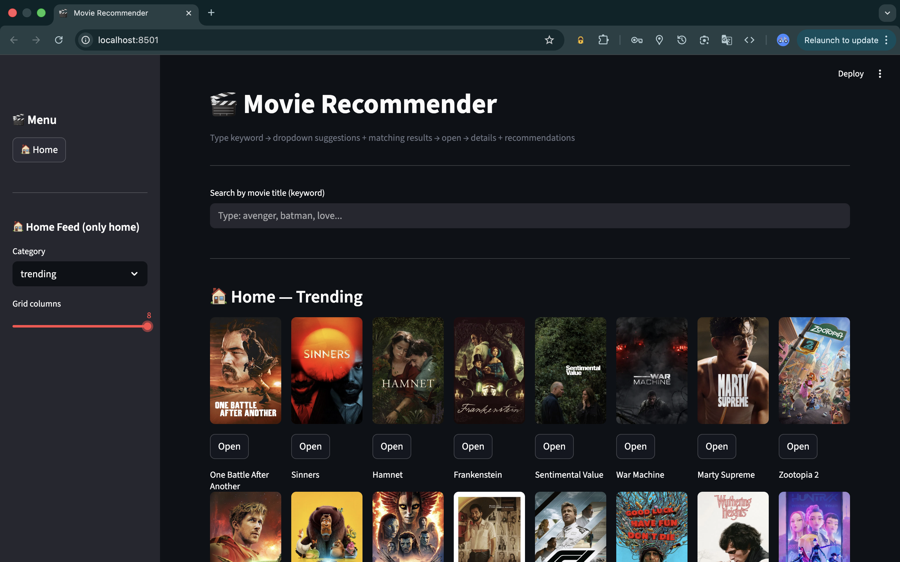
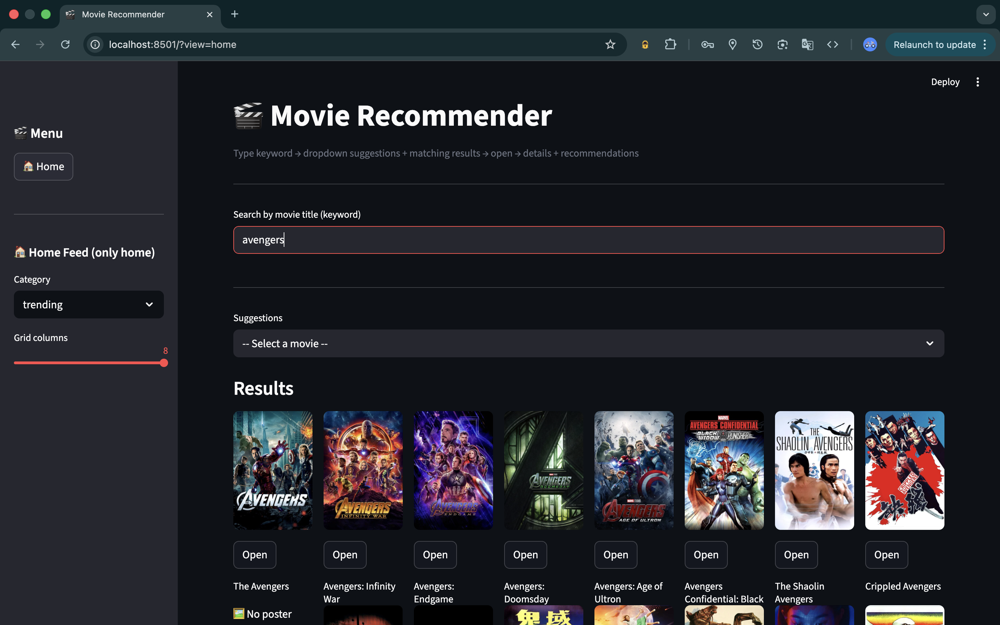

# 🎬 Movie Recommendation System

A hybrid movie recommendation system that combines **content-based filtering (TF-IDF + cosine similarity)** with **genre-based recommendations using the TMDB API**, served through a FastAPI backend and a Streamlit frontend.

This project allows users to:
- Search movies by keyword  
- View movie details and posters  
- Get similar movies using TF-IDF  
- Get genre-based recommendations from TMDB  

---

## 🚀 Features

- 🔎 Keyword search with autocomplete (TMDB)
- 📄 Detailed movie page (overview, genres, release date)
- 🧠 Content-based recommendations using TF-IDF + cosine similarity
- 🎭 Genre-based recommendations using TMDB Discover API
- ⚡ FastAPI backend with robust error handling
- 🖥️ Streamlit interactive frontend

---

## 📸 Screenshots

### 🔎 Movie Search Interface


Users can search for movies using keywords with autocomplete powered by TMDB.

### 🎬 Recommendation Results


The system displays movie details along with TF-IDF based similar movies and genre-based recommendations.

---

## 🏗️ Tech Stack

- **Backend:** FastAPI, Uvicorn  
- **Frontend:** Streamlit  
- **ML/NLP:** Scikit-learn (TF-IDF), NumPy, SciPy  
- **Data:** Pandas  
- **External API:** TMDB (The Movie Database)

---

## 📂 Project Structure

All files are kept in a single directory for simplicity:

```
.
├── main.py                  # FastAPI backend
├── app.py                   # Streamlit frontend
├── df.pkl                   # Preprocessed movie dataframe
├── indices.pkl              # Title → index mapping
├── tfidf.pkl                # Trained TF-IDF vectorizer
├── tfidf_matrix.pkl         # TF-IDF feature matrix
├── movies_metadata.csv     # Original dataset
├── requirements.txt
├── .gitignore
└── README.md
```

---

## 🧠 Recommendation Approach

This is a **Hybrid Recommendation System**:

### 1. Content-Based Filtering (Local Dataset)
- Text features from movie metadata are vectorized using **TF-IDF**
- Similarity is computed using **cosine similarity**
- Top-N similar movies are returned from the local dataset

### 2. Knowledge-Based / Genre-Based (TMDB)
- Fetches movie details from TMDB
- Uses the primary genre to discover popular similar movies
- Enhances recommendations with posters and ratings

---

## 🔧 How to Run Locally

### 1. Clone the Repository

```bash
git clone https://github.com/adars-h-agrawal/movie-recommendation-system.git
cd movie-recommendation-system
```

### 2. Install Dependencies

```bash
pip install -r requirements.txt
```

### 3. Set Up Environment Variable

Create a `.env` file in the root directory:

```
TMDB_API_KEY=your_actual_tmdb_api_key
```

You can get a free API key from: https://www.themoviedb.org/

---

### 4. Run the Backend (FastAPI)

```bash
uvicorn main:app --reload
```

Backend will run at:

```
http://127.0.0.1:8000
```

---

### 5. Run the Frontend (Streamlit)

In a new terminal:

```bash
streamlit run app.py
```

Open in browser:

```
http://localhost:8501
```

---

## 🔌 Main API Endpoints

- `GET /health` – Health check  
- `GET /home` – Home feed (popular, trending, etc.)  
- `GET /tmdb/search` – Keyword search (multiple results)  
- `GET /movie/id/{tmdb_id}` – Movie details  
- `GET /recommend/tfidf` – TF-IDF recommendations only  
- `GET /recommend/genre` – Genre-based recommendations  
- `GET /movie/search` – Combined bundle (details + TF-IDF + genre)

---

## 📈 Example Workflow

1. User searches: `batman`  
2. Selects a movie from suggestions  
3. Views details page  
4. Gets:
   - Similar movies via TF-IDF  
   - More like this via genre-based TMDB  

---

## 🔮 Future Improvements

- Add collaborative filtering using user ratings  
- Add user profiles and watch history  
- Cache TMDB responses with Redis  
- Deploy backend + frontend on cloud  
- Add evaluation metrics (Precision@K, Recall@K)

---

## 👨‍💻 Author

Adarsh Agrawal  
B.Tech – Information Technology  
MIT Manipal  

---

## 📜 License

This project is for educational and research purposes.
